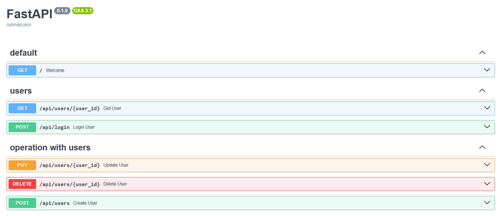

## Разработка микросервиса Python + FastAPI на базе сайта `reqres`  

[Сайт reqres](https://reqres.in)

### Задание:  
1. Разработать несколько API-автотестов на https://reqres.in (если обучались на основном курсе python - можно взять код автотестов из домашнего задания)  
2. Вместо `https://reqres.in` разработать свой микросервис в стеке Python + FastAPI (допускается также Flask, Django).  
 - Автотесты должны также успешно проходить.
 - В коде микросервиса не должно быть хардкода. Например, не должно быть эндпоинтов типа /api/users/2 - правильнее /api/users/{user_id}
3. Данные для ответа пока что можно хранить в коде или в текстовом файле, в следующих занятиях мы перенесем их в базу данных  
4. Оформить README.md

### Реализация:  
1. Разработать реальные автотесты на сайт `reqres.in` 
2. Разработать микросервисы по аналогии ответов на сайте `reqres.in` 
3. Запустить сервер Uvicorn локально  
Команда запуска сервера Uvicorn  
```commandline
uvicorn main:app --port 8000 --reload
```  
*Uvicorn* использует адрес `http://127.0.0.1`.  
Документация расположена по адресу `http://127.0.0.1:8000/docs` 

Пример приложения Swagger:  
    